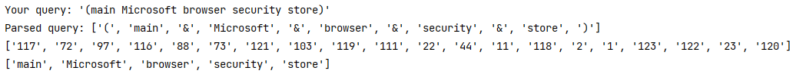

# SearchEngine - Основы информационного поиска

### Build

Follow the following steps to prepare a development environment:

-   Install Python 3.7.3: <https://www.python.org/downloads/>

Install all dependencies 

```bash
pip install -r requirements.txt
```

#### Task 1 - Create crawler and save websites 

Change the directory to the run script
```bash
cd task1
```

In the file ``main.py`` specify the entry point

You can also specify sites in the ``blacklist``, the ``number of pages`` and the ``file name``.

Run script

```bash
python main.py
```

#### Task 2 - Tokenization and lemmatization

Change the directory to the run script
```bash
cd task2
```

Run script. It creates a token file for each source and a lemmatization file

```bash
python main.py
```

#### Task 3 - Inverted index and Boolean search

Change the directory to the run script
```bash
cd task3
```

Run script. It creates `index.json` file with indexes

```bash
python main.py
```

Run search script. You can edit query in `search.py`
```bash
python search.py
```

Result:
* Parsed query
* Suitable documents
* Found words



#### Task 4 - TF-IDF

Change the directory to the run script
```bash
cd task4
```

Run script

```bash
python main.py
```